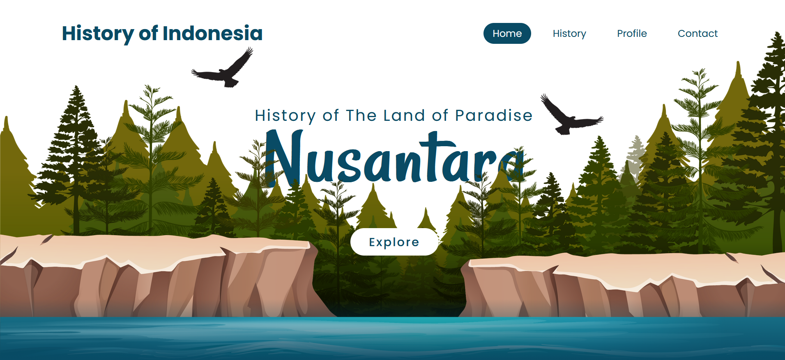
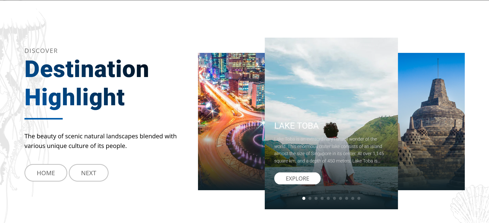
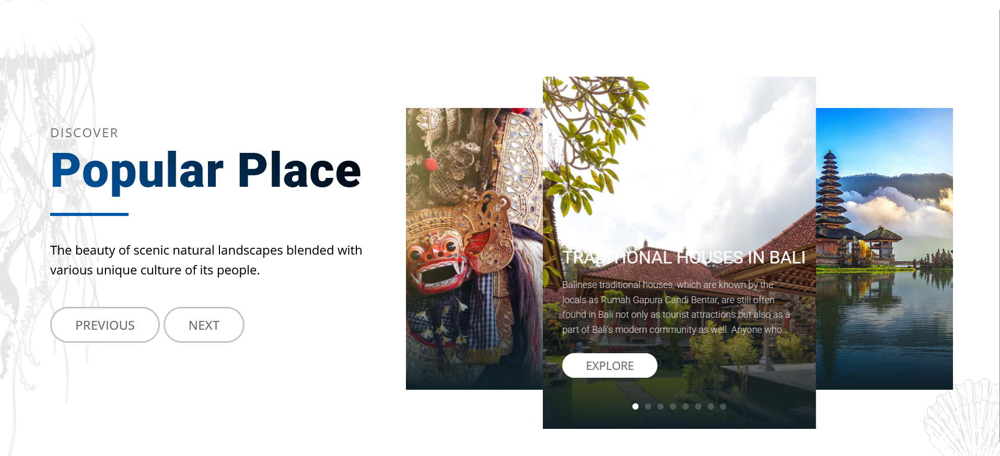

# 🌏 Discovery Indonesia

**Discovery Indonesia** adalah sebuah landing page modern yang memperkenalkan keindahan dan keragaman alam Indonesia.  
Website ini dibuat dengan desain minimalis, interaktif, dan responsif agar pengguna dapat menjelajahi pesona wisata Indonesia dengan pengalaman yang menyenangkan.

🔗 **Live Demo:** [https://discovery-indonesia.vercel.app/](https://discovery-indonesia.vercel.app/)

---

## 📸 Preview


*Tampilan halaman utama website Discovery Indonesia.*



*Tampilan halaman History website Discovery Indonesia.*



*Tampilan halaman Destination highlight website Discovery Indonesia.*



*Tampilan halaman Popular Place website Discovery Indonesia.*
---

## ⚙️ Cara Menjalankan Proyek Secara Lokal

1. **Clone repository ini:**
   ```bash
   git clone https://github.com/Lxtream23/discovery-indonesia.git
   ```

2. **Masuk ke folder proyek:**
   ```bash
   cd discovery-indonesia
   ```

3. **Buka file `index.html`** di browser:
   - Klik dua kali file `index.html`, atau  
   - Jalankan server lokal (opsional):
     ```bash
     npx serve
     ```
   lalu buka [http://localhost:3000](http://localhost:3000).

---

## 🛠️ Teknologi yang Digunakan

- **HTML5** — Struktur utama halaman  
- **CSS3 / TailwindCSS** — Desain modern dan responsif  
- **JavaScript (ES6)** — Interaktivitas dan animasi ringan  
- **Vercel** — Platform deployment yang cepat dan stabil  

---

## 📂 Struktur Folder Utama

```bash
TUGAS 2/
│
├── 404pageNotFound/          # Halaman error untuk navigasi yang tidak ditemukan
├── contact/                  # Halaman kontak
├── destination/              # Halaman utama destinasi wisata
├── destination highlight/    # Sorotan destinasi unggulan
├── history/                  # Halaman sejarah Indonesia
├── Picture/                  # Folder gambar dan aset visual
├── popular-place/            # Halaman tempat wisata populer
├── profile/                  # Halaman profil pembuat atau profil situs
│
├── index.html                # Halaman utama website
├── script.js                 # File JavaScript utama
├── style.css                 # File CSS utama
└── README.md                 # Dokumentasi proyek
```

---

## ✨ Fitur Utama

- Tampilan **modern dan responsif**
- Desain yang **ramah pengguna**
- Navigasi yang **halus dan intuitif**
- Konten informatif mengenai **destinasi wisata Indonesia**

---

## 🧾 Lisensi

Proyek ini dilisensikan di bawah lisensi **MIT** — Anda bebas menggunakan, menyalin, dan memodifikasi proyek ini selama mencantumkan atribusi kepada pembuat asli.

---

## 👨‍💻 Dibuat oleh

Lukman Hakim
Mahasiswa & Web Developer yang mencintai keindahan alam 
📍 Universitas Yudharta Pasuruan
📧 lukmanhakim23072002@gmail.com

---

> “Temukan keindahan Indonesia, dari Sabang sampai Merauke.”
